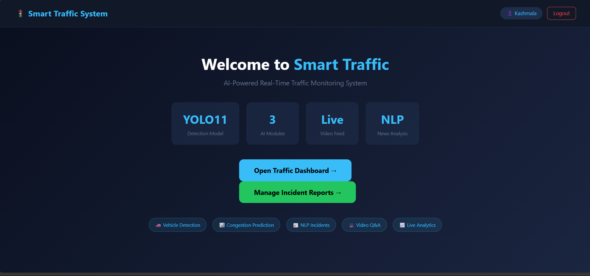
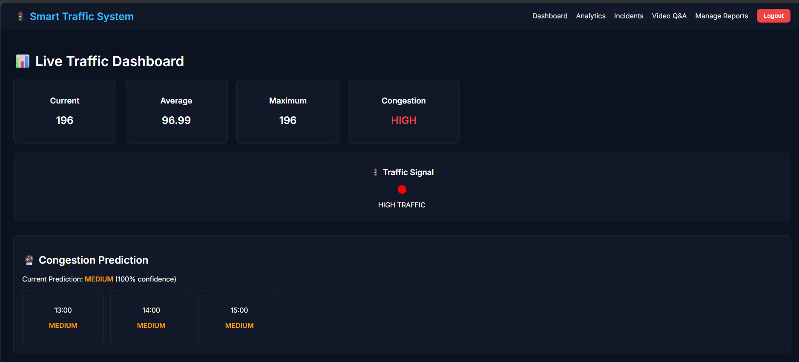
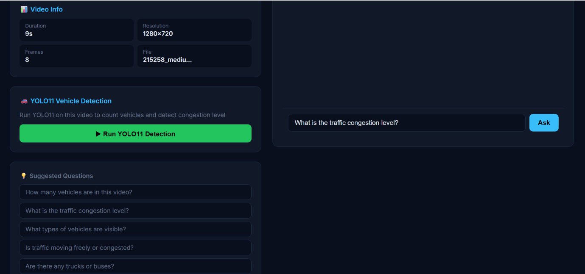
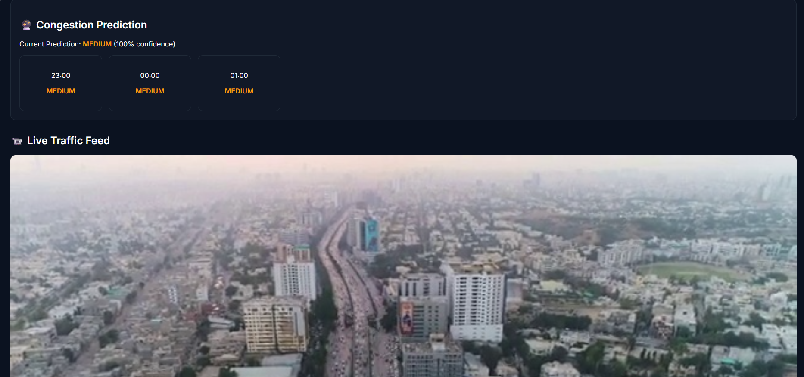
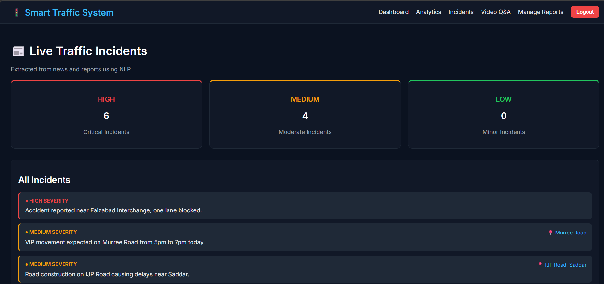
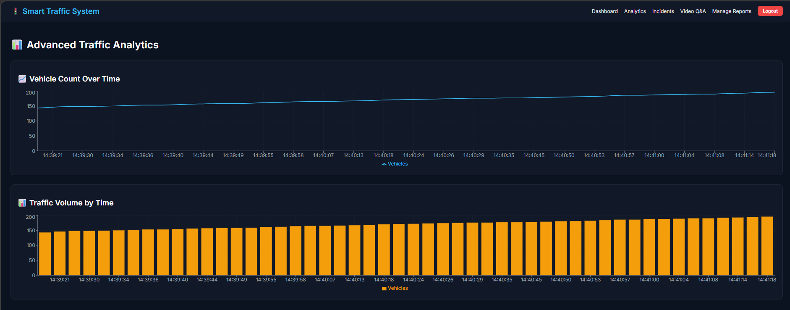
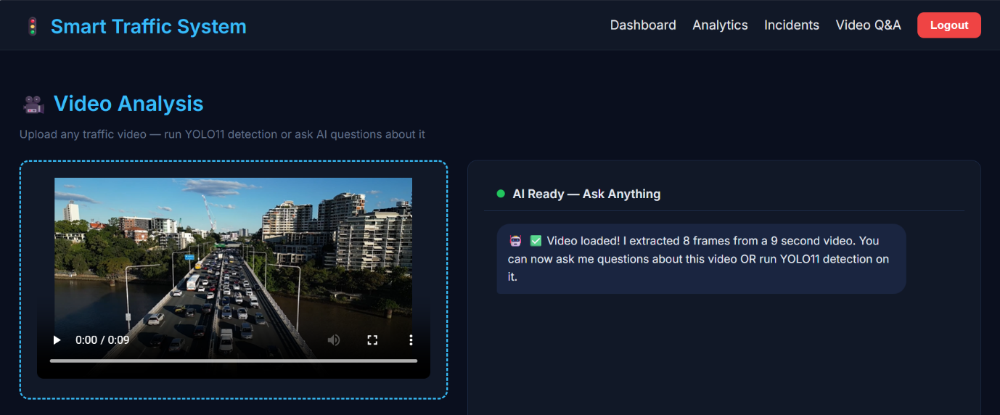

# 🚦 Smart Traffic Monitoring System

An AI-powered smart traffic monitoring platform that combines Computer Vision, Machine Learning, and Natural Language Processing to perform real-time vehicle detection, congestion prediction, and incident analysis. The system features a full-stack web application built with Django and React, along with an AI-powered Video Q&A assistant using the Gemini API.

---

## 📌 Overview

This project is designed to improve traffic monitoring and management by automating vehicle detection, predicting congestion levels, extracting incident information from reports, and enabling users to ask natural language questions about traffic footage.

---

## ✨ Features

- ✅ Real-time vehicle detection using **YOLO11**
- ✅ Traffic congestion prediction using **Gradient Boosting**
- ✅ NLP-based incident extraction using **spaCy**
- ✅ AI-powered Video Q&A using the **Gemini API**
- ✅ Interactive analytics dashboard built with **React.js**
- ✅ RESTful backend developed using **Django REST Framework**

---

## 🛠️ Tech Stack

### Backend
- Python
- Django
- Django REST Framework

### Frontend
- React.js
- HTML
- CSS
- JavaScript

### Artificial Intelligence
- YOLO11
- OpenCV
- Gradient Boosting
- spaCy
- Gemini API

---

## ⚙️ How It Works

1. Traffic videos are processed using **YOLO11** for real-time vehicle detection.
2. Vehicle counts and traffic patterns are analyzed using a **Gradient Boosting** model to predict congestion levels.
3. Traffic incident reports are processed using **spaCy** to extract structured incident information.
4. The processed data is served through a **Django REST API** and visualized on a **React.js dashboard**.
5. Users can interact with traffic footage using natural language through the **Gemini-powered Video Q&A** feature.

---
---

## 🚀 Installation

### Clone the Repository

```bash
https://github.com/KashmalaShafique/Smart-Traffic-Monitoring-System.git
cd Smart-Traffic-Monitoring-System
```

### Backend Setup

```bash
cd backend

python -m venv venv

# Windows
venv\Scripts\activate

# Linux/macOS
source venv/bin/activate

pip install -r requirements.txt

python manage.py migrate

python manage.py runserver
```

### Frontend Setup

```bash
cd frontend

npm install

npm start
```
---

## 🚀 Quick Start (Windows)

For Windows users, a `start.bat` script is included to automatically launch both the Django backend and React frontend.

```bash
start.bat
```

This script starts both servers in a single step, eliminating the need to launch them manually in separate terminals.

## 🔑 Gemini API Configuration

This project requires a **Google Gemini API Key** for the Video Q&A feature.

Before running the project:

1. Obtain your own Gemini API key from Google AI Studio.
2. Open the following file:

```text
videoQA/views.py
```

3. Replace:

```python
GEMINI_API_KEY = "YOUR_GEMINI_API_KEY_HERE"
```

with your own Gemini API key:

```python
GEMINI_API_KEY = "YOUR_ACTUAL_GEMINI_API_KEY"
```

4. Save the file and run the project normally.

> **Note:** For security reasons, the original API key has been removed from this repository.

## 📸 Screenshots

### 🏠 Home Page



### 📊 Traffic Dashboard



### 🚗 Vehicle Detection



### 🚦 Congestion Prediction



### 📝 Incident Analysis



### 📈 Analytics Dashboard



### 🎥 Video Q&A




## 📹 Demo Video

The original traffic video used for testing is **not included** in this repository because of its large size.

You can use any traffic surveillance video in MP4 format and place it in the appropriate location before running the project.
where to add this in readme

---
---

## 📂 Project Structure

```text
SmartTrafficSystem/
│
├── .gitignore
├── README.md
├── start.bat
├── data/
├── frontend/
├── models/
├── screenshots/
├── src/
├── traffic_backend/
│   ├── authentication/
│   ├── nlp/
│   ├── prediction/
│   ├── traffic/
│   ├── videoqa/
│   ├── templates/
│   ├── traffic_backend/
│   ├── manage.py
│   └── requirements.txt
│
└── package-lock.json
```

## 📈 Future Improvements

- Live CCTV camera integration
- Automatic accident detection
- Multi-camera support
- Traffic density heatmaps
- Mobile application
- Cloud deployment
- Advanced analytics and reporting

---

## 👩‍💻 Author

**Kashmala Shafique**

BS Artificial Intelligence Student

University of Wah

---

## 📄 License

This project is developed for academic and portfolio purposes.
